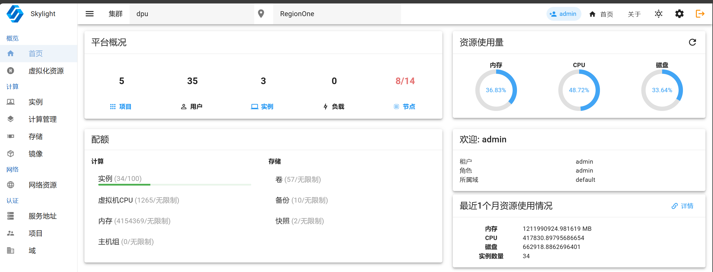

# Skylight

Openstack Dashboard with Vuetify

预览

 


## 1 环境要求

+ go >= 1.21.5
+ nodjs >= 22.5
+ vuetify >= 2.17
+ vue3

## 2.以容器方式启动

```bash
docker run -v registry.aliyun.com/fjboy-c/skylight
```

## 3 构建并推送镜像

```bash
sh release/build.sh
```

## 5 开发者

1. 启动后端服务
   
   ```
   cd skylight-go
   go run main.go
   ```

2. 启动前端服务
   
   ```bash
   cd skylight-web
   npm install
   npm run dev
   ```

3. 构建前端和后端项目

```bash
# 构建后端项目
cd skylight-go
go build

cd ../
# 构建前端项目
npm run install
npm run build

```

*更多用法参考帮助信息。*
