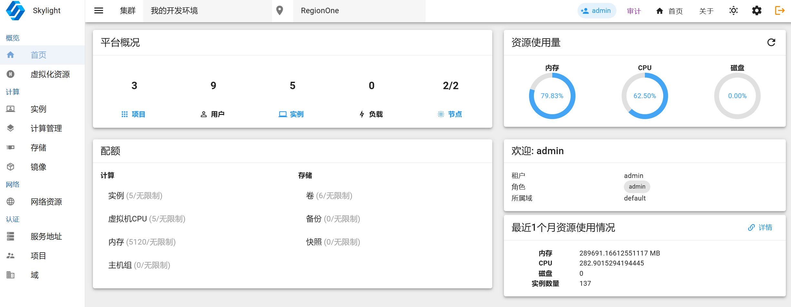

# Skylight

Openstack Dashboard with Vuetify

<!-- 预览

 
-->

## 1 环境要求

+ go >= 1.21.5
+ npm
+ nodjs

## 2 运行（开发者模式）

1. 启动后端服务

```bash
cd skylight-go
go run main.go  -d
```

2. 启动前端服务
```bash
cd skylight-web
npm install
npm run dev
```

## 3 构建

构建后端项目
```bash
cd skylight-go
go build
```

构建前端项目
```bash
npm run install
npm run build
```

*更多用法参考帮助信息。*
